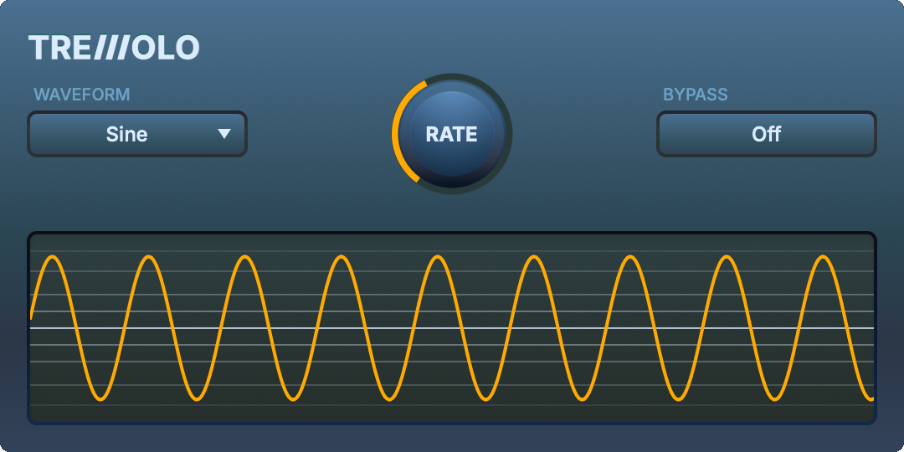

<div align="center">

# Tremolo Audio Plugin

[](LICENSE.md)




A JUCE-based tremolo audio effect developed as a hands-on audio plugin
learning project. The project includes real-time DSP, parameter smoothing,
state restoration, a custom GUI, LFO visualization, and automated tests.

Based on the
[Official JUCE Audio Plugin Development Course](https://www.wolfsoundacademy.com/juce).


</div>

## ✨ Features

* Preconfigured plugin formats:
  * AU
  * VST3
  * Standalone
* Tremolo audio effect: tremolo is amplitude modulation at a rate below the human hearing range. The result is a "pulsing" sound.
* Tremolo parameters:
  * Sine and triangle LFO waveforms
  * Modulation rate from 0.1 Hz to 20 Hz
  * Modulation depth from 0% to 100%
  * Bypass control
* Smooth modulation-depth changes
* Smooth transitions between LFO waveforms
* Smooth bypass transitions
* Custom plugin editor with parameter attachments
* Real-time LFO position indicator
* Scrolling LFO waveform display
* Lock-free FIFO communication between the audio and GUI threads
* Plugin state serialization and restoration
* Automated tests for DSP, state handling, smoothing, and FIFO boundaries

## 📋 Requirements

You need to have the following software installed on your machine:

* Git version control system
* CMake 3.25 or higher (the one bundled with CLion 2025.1.1 or higher should work)
* C++ compiler and build system. Tested on:
  * macOS: Xcode 15.4 (Apple Clang 15.0.0.15000309), 16.4 (Apple Clang 17.0.0.17000013)
  * Windows: Visual Studio 2022 17.14.13 (MSVC 19.44.35215)
  * Ubuntu, Debian: gcc 12.2.0, 13.3.0 and make 4.3

## 🚀 Getting Started

Clone the repository:

```bash
git clone https://github.com/Kong0129/juce-tremolo-learning.git
cd juce-tremolo-learning
```

Configure the completed learning project with tests enabled:

```bash
cmake -S todo -B todo/cmake-build -DBUILD_TESTS=ON
```

Build and run the Debug tests:

```bash
cmake --build todo/cmake-build --config Debug --target TremoloCoursePluginTest
ctest --test-dir todo/cmake-build -C Debug --output-on-failure
```

Build the Release VST3:

```bash
cmake --build todo/cmake-build --config Release --target TremoloCoursePlugin_VST3
```

On Windows, the VST3 is automatically copied to:

```text
%LOCALAPPDATA%\Programs\Common\VST3\KongTremolo.vst3
```

The first configuration and build may take longer because CMake downloads and builds the required dependencies.

## 📂 Structure

* `todo/` contains the implementation completed throughout this learning project.
* `complete/` contains the reference implementation supplied by the original course.
* `todo/tremolo_plugin/` contains the plugin DSP, parameters, state handling, and GUI.
* `todo/test/` contains the automated GoogleTest test suite.
* `docs/` contains images and documentation assets.

## 🤝 Contributing

This repository documents my JUCE audio plugin development learning process.
Bug reports and suggestions are welcome through GitHub issues.

## 📜 License

We use the incredibly liberal ["Unlicense" license](LICENSE.md). You can basically do whatever you want with the code. Remember that the commercial use of products built with JUCE requires a JUCE license. Refer to the JUCE license for details.
